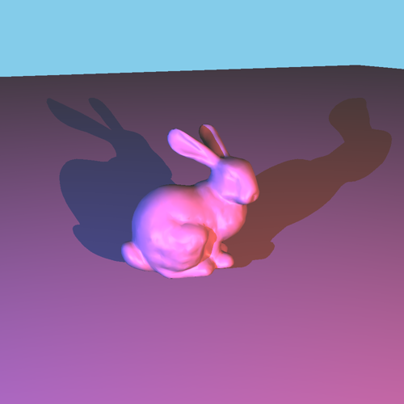

# Rust Triangle Raytracer

Triangle raytracer using Möller–Trumbore intersection tests and Blinn-Phong shading. Primarily a project to learn Rust.

## Done

- triangle rendering
- blinn-phong shading
- multiple coloured lights + shadows
- basic .obj support
- math types, 4d matrix and vectors

## TODO

- different brdf
    - blinn-phong doesn't look great, maybe cook-torrance?
- command line options
    - in/output files
    - camera parameters
- more .obj/.mtl support
    - textures, vertex normals, etc.
- full path tracing, "monte-carlo renderer"
- optimization
    - spatial division (kd-trees or octrees), multithreading, etc.
