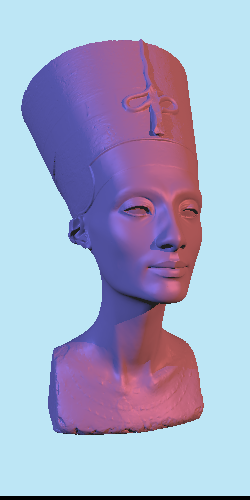

# Rust Triangle Raytracer

*~500,000 triangles in 60 seconds*

Triangle raytracer using Möller–Trumbore intersection tests, kd-trees and Blinn-Phong shading.

Primarily a project to learn Rust.

## Done

- triangle rendering
- vertex normal estimation
- surface normal interpolation
- blinn-phong shading
- multiple coloured lights + shadows
- basic .obj support
- math types, 4d matrices/vectors
- multithreading
- spatial divison with kd-tree

## TODO

- different brdf
    - blinn-phong doesn't look great, maybe cook-torrance?
- command line options
    - in/output files
    - camera parameters
- more .obj/.mtl support
    - textures, vertex normals, etc.
- full path tracing, "monte-carlo renderer"
- optimization
    - improve thread work distribution, some threads finish way early leaving cores unused
    - etc.
